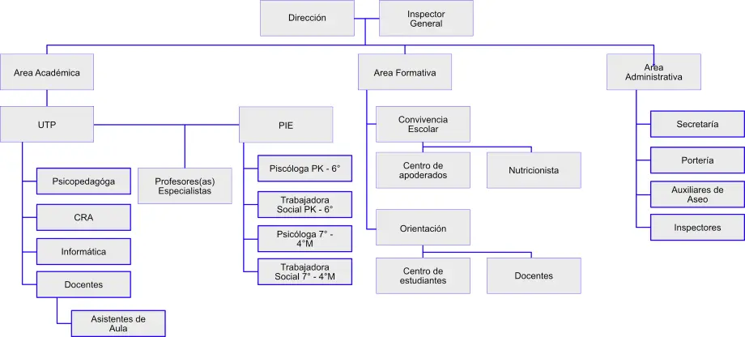

En esta sección encontrarás información sobre como se organiza el establecimiento, su información técnica y administrativa. Información como los horarios de clase, los niveles y el organigrama escolar.

## Niveles y horarios de clase

En el establecimiento se imparten los niveles de educación parvularia, enseñanza básica y enseñanza media. Los horarios estan establecidos y corresponden a un liceo con enseñanza escolar completa.

### Educación Parvularia (NT1 y NT2) 

| Días      | Hora de Entrada | Hora de Salida |
|-----------|-----------------|----------------|
| Lunes     |       8:30      |      15:55     |
| Martes    |       8:30      |      15:55     |
| Miércoles |       8:30      |      15:55     |
| Jueves    |       8:30      |      15:55     |
| Viernes   |       8:30      |      14:15     |

### Enseñanza Básica (1° a 8°)

| Días      | Hora de Entrada | Hora de Salida |
|-----------|-----------------|----------------|
| Lunes     |       8:30      |      15:55     |
| Martes    |       8:30      |      15:55     |
| Miércoles |       8:30      |      15:55     |
| Jueves    |       8:30      |      15:55     |
| Viernes   |       8:30      |      15:55     |

### Enseñanza Media (1M° a 4M°)

| Días      | Hora de Entrada | Hora de Salida |
|-----------|-----------------|----------------|
| Lunes     |       8:30      |      15:55     |
| Martes    |       8:30      |      17:35     |
| Miércoles |       8:30      |      17:35     |
| Jueves    |       8:30      |      15:55     |
| Viernes   |       8:30      |      14:15     |

## Organigrama

## Mecanismos de comunicación con padres y apoderados

Como establecimiento optamos por las siguientes formas de comunicación con nuestros apoderados: 

1. Citación a entrevista presencial 
2. Llamados telefónicos 
3. Citaciones por escrito vía libreta de comunicaciones 
4. Grupos por cursos (Whatsapp) 
5. Página web y Redes Sociales oficiales